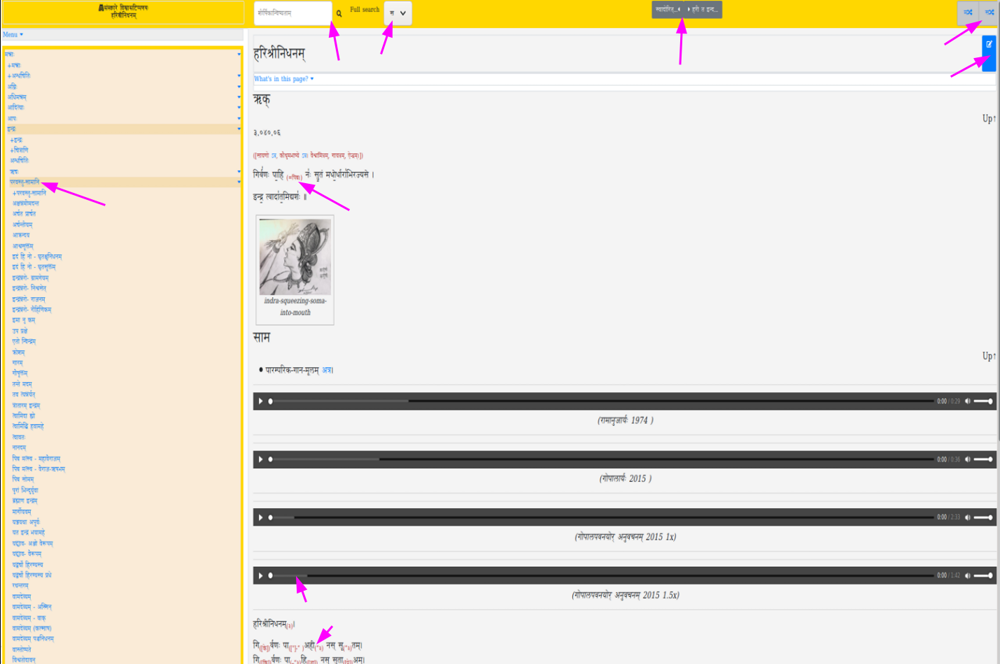

## Intro
A wiki-like theme for managing and presenting your content in Hugo - with special support for Sanskrit/ Indic languages (where mixed case words are common when Roman script is used).

## Features

Some notable things you get with this theme (in decreasing order of interest):

- A collapsible "accordion" sidebar
  - automatic directory listing for use within sidebar
- A collapsible "accordion" table-of-contents for each page.
- "Next and Previous" page navigation buttons.
- A layout which automatically adjusts to the user's screen size.
- An "Edit me" link on top of each page.
- Basic ability to include contents from another page using the same theme within anoher.
- embedding audio and video items
- inline annotation
- search
  - json based search
  - support for google based search
  - Search engine optimization and webmaster stuff - which you would use with various search engines.
- Disqus for comments.
- Special formatting consideration for fonts which need to be displayed bigger (eg: Devanagari for sanskrit.)
- Support for optionally enabling MathML.
  - See layouts/partials/mathjax_tex_commands.html for useful tex shortcuts.
- Transliteration dropdown: Substitute devanAgarI with other scripts!
- Portability
  - We try to minimize the use of liquid templating language in favor of accomplishing stuff (menus, tables of contents, page inclusions) with javascript. This makes it a bit easier to move to another static website generator like hugo in the future.

## Example sites

- https://vishvAsa.github.io/devaH/mantraH/rogAH/padyAni/corona-virus/
- https://vishvAsa.github.io/notes/
- https://sanskrit-coders.github.io/
- https://sanskrit.github.io/

## Usage

### Recommendations about config.toml
#### Recommended settings
disablePathToLower = true Since we assume mixed case to have special meaning.

#### canonifyURLs
canonifyURLs = True won't work well as of 20190304. .URL variable does will then not include the subdirectory portion of the basepath (ie kAvya/ bit in http://localhost:1313/kAvyam/), leading to urls like http://localhost:1313/TIkA/padya/kAlidAsa/raghuvaMsha/01/ instead of  http://localhost:1313/kAvyam/TIkA/padya/kAlidAsa/raghuvaMsha/01/.

## Code Contributions
### JS and CSS
Javascript and css dependencies are mostly managed with npm and webpack.
If you modify javascript (src folder) or add some bundled css, you must rerun webpack. A good workflow for such development:

- Switch to webpack_src directory.
- Clean node_modules if needed.
- Run `npm install`
- Run `npm run watch`